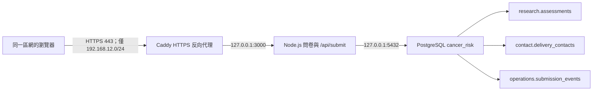

# 開發者與新電腦快速上手手冊

本文件提供三種對象的完整操作流程：

1. 區網電腦只需安全使用問卷。
2. 第一次參與開發，需要取得程式碼、執行測試或查看資料。
3. 需要把整套服務建到另一台 Windows 地端伺服器。

文件中的密碼一律以 `<...>` 表示。請向專案管理員透過核准的安全管道取得，絕對不要
把真實密碼貼到 Git、Email、聊天記錄、截圖或 Issue。

## 1. 目前架構與固定資訊



目前這台伺服器的設定：

| 項目 | 值 |
| --- | --- |
| Windows 主機名 | `DESKTOP-2LF2A4I` |
| 區網 IP | `192.168.12.22` |
| 區網範圍 | `192.168.12.0/24` |
| 公開入口 | `https://192.168.12.22` |
| Caddy | `EGBioMedCancerRiskHttps` Windows 服務 |
| Node.js | `EGBioMedCancerRisk` Windows 服務，僅監聽 `127.0.0.1:3000` |
| PostgreSQL | `postgresql-x64-18` Windows 服務，僅監聽本機 5432 |
| 資料庫 | `cancer_risk` |
| 服務日誌 | `C:\ProgramData\EGBioMed\CancerRisk\logs` |
| 根憑證 | `C:\ProgramData\EGBioMed\CancerRisk\certificates\EG-BioMed-LAN-Root-CA.crt` |

路由器必須替 `192.168.12.22` 設定 DHCP 保留位址。若 IP、主機名、專案路徑或
PostgreSQL 主版本改變，請依「情境 C」同步修改設定，不能只複製現有服務檔。

## 2. 開始前先辨認你的情境

| 需求 | 請執行 |
| --- | --- |
| 只填寫或測試問卷，不碰程式碼與資料庫 | 情境 A |
| 修改 UI、API、測試或經授權查看資料 | 情境 B |
| 把服務完整安裝至另一台 Windows 電腦 | 情境 C |

## 情境 A：區網電腦只需使用問卷

### A1. 確認網路

電腦必須位於允許的 `192.168.12.0/24` 區網。先在 PowerShell 測試：

```powershell
Test-NetConnection 192.168.12.22 -Port 443
```

`TcpTestSucceeded` 應為 `True`。如果是 `False`，先確認 Wi-Fi／網路線、伺服器是否
開機、IP 是否改變，以及是否連到訪客網路或被 AP 隔離。

### A2. 安裝 HTTPS 根憑證

1. 請伺服器管理員提供 `EG-BioMed-LAN-Root-CA.crt`，並另外提供目前的 SHA-256。
2. 在收到檔案的電腦計算雜湊：

```powershell
Get-FileHash ".\EG-BioMed-LAN-Root-CA.crt" -Algorithm SHA256
```

3. 與管理員提供的值逐字比對；不一致就停止，不要安裝。
4. 以「系統管理員身分」開啟 PowerShell，再執行：

```powershell
certutil -addstore -f Root ".\EG-BioMed-LAN-Root-CA.crt"
```

5. 完全關閉再重新開啟瀏覽器，前往：

```text
https://192.168.12.22
```

只可散布匯出的 `.crt` 公開憑證；絕對不可複製或分享伺服器
`C:\ProgramData\EGBioMed\CancerRisk\caddy\data\caddy\pki` 目錄。

### A3. 驗證服務

瀏覽以下網址：

```text
https://192.168.12.22/api/health
```

正常結果應包含：

```json
{
  "ok": true,
  "submission_mode": "postgres",
  "database": "postgresql",
  "database_ready": true
}
```

不要用忽略憑證警告的方式正式使用。若出現憑證警告，依疑難排解章節處理。

## 情境 B：第一次參與開發

### B1. 取得權限與工具

請先向專案管理員確認：

- GitHub repository 讀寫權限及分支規則。
- 是否需要研究、聯絡或維運資料權限；三者不得預設全部授予。
- 是否只能透過遠端桌面登入地端伺服器操作 pgAdmin。
- Node.js 24 以上、Git、PowerShell、VS Code 或其他核准的編輯器。
- 只有需要資料庫 GUI 時才安裝 pgAdmin。

PostgreSQL 目前只綁定 localhost。開發者在其他電腦不能直接連到 5432；請在伺服器
本機／遠端桌面使用 pgAdmin，或使用組織核准的 VPN／SSH tunnel。不得自行新增
Windows Firewall 5432 入站規則。

### B2. 取得程式碼

```powershell
Set-Location "<你的開發資料夾>"
git clone https://github.com/EG-Abbie/10-Cancer-Risk-AI-Platform.git
Set-Location ".\10-Cancer-Risk-AI-Platform"
git status
```

如果專案已存在：

```powershell
Set-Location "<專案絕對路徑>"
git status
git pull --ff-only
```

第一次在這個 repository 提交前，只設定本專案作者身分，不必改全域設定：

```powershell
git config --local user.name "<GitHub 顯示名稱>"
git config --local user.email "<公司或 GitHub 核准 Email>"
```

所有 `scripts\...` 指令都必須從專案根目錄執行。若提示
`-File 參數的 scripts\xxx.ps1 引數不存在`，通常是仍停在 `C:\Users\<帳號>`；先
執行 `Set-Location "<專案絕對路徑>"`。

### B3. 安裝相依套件及跑基準測試

```powershell
npm ci
npm test
```

目前完整測試應有 22 項。若 PATH 尚未更新：

```powershell
& "C:\Program Files\nodejs\npm.cmd" ci
& "C:\Program Files\nodejs\node.exe" --test test-contract.js test-questionnaire-ui.js test-postgres-repository.js test-backup-retention.js
```

修改問卷、答項、欄位 mapping 或提交格式時，至少執行：

```powershell
npm run generate:answer-codes
npm test
git diff --check
git status
```

### B4. 建立個人本機執行設定

`runtime/` 已被 `.gitignore` 排除。建立設定後不要提交：

```powershell
New-Item -ItemType Directory -Path ".\runtime" -Force
Copy-Item ".\.env.example" ".\runtime\database.env"
notepad ".\runtime\database.env"
```

需要修改的範例：

```text
SUBMISSION_MODE=postgres
PGHOST=127.0.0.1
PGPORT=5432
PGDATABASE=cancer_risk
PGUSER=cancer_app_writer
PGPASSWORD=<向管理員取得的本機密碼>
PGPOOL_MAX=20
RUN_DATABASE_MIGRATIONS=false
HOST=127.0.0.1
PORT=3000
```

`RUN_DATABASE_MIGRATIONS` 日常必須維持 `false`。只有資料庫 owner 在明確執行 migration
時才能暫時啟用。

### B5. 手動啟動開發站台

地端伺服器已使用 Windows 服務，不需要手動啟動。只有個人開發環境才執行：

```powershell
powershell -NoProfile -ExecutionPolicy Bypass -File ".\scripts\start-postgres-local.ps1"
```

該視窗關閉後手動開發站台也會停止。測試：

```text
http://127.0.0.1:3000/api/health
```

如果同一台電腦的 `EGBioMedCancerRisk` 服務已在執行，3000 port 會被占用。不要同時
啟動第二份；先使用服務版本，或經管理員核准後暫停服務。

### B6. 使用 pgAdmin 查看資料

在 pgAdmin 的 `Register > Server`：

**General**

- Name：自訂，例如 `Cancer Risk Local PostgreSQL`

**Connection**

- Host name/address：`127.0.0.1`
- Port：`5432`
- Maintenance database：`cancer_risk`
- Username：管理員配發的個人帳號，例如 `<developer_login>`
- Password：管理員透過安全管道配發的密碼
- Save password：只可在受公司管理且有磁碟加密的電腦勾選

連線後依序展開：

```text
Servers
└─ Cancer Risk Local PostgreSQL
   └─ Databases
      └─ cancer_risk
         └─ Schemas
            ├─ research
            ├─ contact
            └─ operations
```

右鍵 `cancer_risk` 選擇 `Query Tool`，依權限查詢：

```sql
SELECT record_id, submitted_at, processing_status, model_input
FROM research.assessments
ORDER BY submitted_at DESC
LIMIT 100;
```

```sql
SELECT record_id, email, delivery_status, submitted_at
FROM contact.delivery_contacts
ORDER BY submitted_at DESC
LIMIT 100;
```

```sql
SELECT event_id, record_id, event_type, event_status, event_at, detail
FROM operations.submission_events
ORDER BY event_at DESC
LIMIT 100;
```

看到 `permission denied` 時不要改用 `postgres` 超級使用者規避；請管理員確認你所屬的
角色是否符合工作需求。

### B7. Git 日常流程

```powershell
git status
git switch -c "codex/<工作名稱>"
# 修改並測試
npm test
git diff --check
git status
git add <明確檔案清單>
git commit -m "<清楚描述變更>"
git push -u origin "codex/<工作名稱>"
```

不要把 `runtime/`、`.env`、`local-backups/`、`local-exports/`、憑證私鑰或真實健康資料
加入 Git。提交前務必用 `git status` 再檢查一次。

## 情境 C：在另一台 Windows 電腦建立完整伺服器

此流程需要本機系統管理員、資料庫管理員及網路管理權限。新伺服器投入真實資料前，
必須另完成正式資安及個資審查。

### C1. 系統需求

- Windows 11 Pro 或受支援的 Windows Server，固定開機且停用睡眠。
- Node.js 24 以上。
- PostgreSQL 18（若使用其他主版本，服務名稱與路徑必須同步調整）。
- Git 與 pgAdmin。
- Caddy 2.11.4 Windows AMD64。
- WinSW 2.12.0 x64。
- 路由器 DHCP 保留位址及核准的區網 CIDR。

只從官方來源下載：

- Node.js：<https://nodejs.org/en/download>
- PostgreSQL Windows installer：<https://www.postgresql.org/download/windows/>
- pgAdmin：<https://www.pgadmin.org/download/pgadmin-4-windows/>
- Caddy 2.11.4：<https://github.com/caddyserver/caddy/releases/tag/v2.11.4>
- WinSW 2.12.0：<https://github.com/winsw/winsw/releases/tag/v2.12.0>

目前安裝腳本鎖定的執行檔 SHA-256：

```text
Caddy 2.11.4 caddy.exe
5CB9AB71E5756CE72840B8234177A2F40C8B4AB47A806B8E841E2B784E9DF62B

WinSW 2.12.0 WinSW-x64.exe
05B82D46AD331CC16BDC00DE5C6332C1EF818DF8CEEFCD49C726553209B3A0DA
```

目前安裝腳本會驗證 Caddy 與 WinSW 的固定 SHA-256；下載其他版本時，不能直接略過
驗證，必須由維運人員驗證官方 checksum、更新腳本中的 expected hash 並重新測試。

### C2. 複製程式碼並調整機器固定值

先 clone repository，再確認以下檔案：

- `deployment\windows\EGBioMedCancerRisk.xml`
  - `<arguments>` 內的專案絕對路徑。
  - `<workingdirectory>` 專案絕對路徑。
  - `<depend>` PostgreSQL Windows 服務名稱。
- `deployment\windows\Caddyfile`
  - HTTPS 主機名與 IP。
  - `bind` 的 localhost 與區網 IP。
- `deployment\windows\install-https-service.ps1`
  - `LocalAddress`、`RemoteAddress`。
  - 最後輸出的 URL。

取得新機器資料：

```powershell
hostname
Get-NetIPAddress -AddressFamily IPv4 | Where-Object IPAddress -NotLike "127.*"
Get-Service "postgresql*"
```

先讓網路管理員保留 IP，再修改上述設定。不要使用 DHCP 可能重新分配的暫時 IP。

### C3. 建立 PostgreSQL 資料庫

以下命令需使用 PostgreSQL 管理員帳號，從專案根目錄執行：

```powershell
$psql = "C:\Program Files\PostgreSQL\18\bin\psql.exe"
& $psql -U postgres -d postgres -c "CREATE DATABASE cancer_risk;"
& $psql -U postgres -d cancer_risk -f ".\database\migrations\001_initial.sql"
& $psql -U postgres -d cancer_risk -f ".\database\development-roles.sql"
```

設定 app writer 密碼，密碼不得出現在指令歷程或文件中；建議進入互動式 `psql` 後執行：

```sql
ALTER ROLE cancer_app_writer WITH LOGIN PASSWORD '<產生的高強度密碼>';
```

為每位開發者建立獨立 login，不共用帳號：

```sql
CREATE ROLE <developer_login> LOGIN PASSWORD '<個人高強度密碼>';
GRANT cancer_research_developer TO <developer_login>;
-- 只有工作需要時才另外授予：
-- GRANT cancer_contact_developer TO <developer_login>;
-- GRANT cancer_operations_developer TO <developer_login>;
```

確認 PostgreSQL 的 `listen_addresses` 僅為 `localhost`／`127.0.0.1`，且 `pg_hba.conf`
沒有未經核准的區網或公網規則。密碼驗證使用 SCRAM。

### C4. 建立 runtime 設定並測試 Node

```powershell
New-Item -ItemType Directory -Path ".\runtime" -Force
Copy-Item ".\.env.example" ".\runtime\database.env"
notepad ".\runtime\database.env"
npm ci
npm test
powershell -NoProfile -ExecutionPolicy Bypass -File ".\scripts\start-postgres-local.ps1"
```

確認 `http://127.0.0.1:3000/api/health` 的 `database_ready` 為 `true`，再按 `Ctrl+C`
停止手動程序。

### C5. 安裝 Node.js Windows 服務

以系統管理員 PowerShell 從專案根目錄執行；`<WinSW.exe>` 必須是已驗證的官方檔案：

```powershell
powershell -NoProfile -ExecutionPolicy Bypass `
  -File ".\deployment\windows\install-service.ps1" `
  -WinSWPath "<WinSW.exe 的絕對路徑>"
```

驗證：

```powershell
Get-Service postgresql-x64-18,EGBioMedCancerRisk
Invoke-RestMethod http://127.0.0.1:3000/api/health
```

### C6. 安裝 HTTPS、憑證與區網防火牆

先確認 Caddyfile 與安裝腳本已改為新機器的主機名、固定 IP 與 CIDR。以系統管理員
PowerShell 執行：

```powershell
powershell -NoProfile -ExecutionPolicy Bypass `
  -File ".\deployment\windows\install-https-service.ps1" `
  -CaddyPath "<caddy.exe 的絕對路徑>" `
  -WinSWPath "C:\ProgramData\EGBioMed\CancerRisk\service\EGBioMedCancerRisk.exe"
```

安裝腳本會：

1. 驗證 Caddy／WinSW SHA-256。
2. 安裝 `EGBioMedCancerRiskHttps` 自動服務並依賴 Node 服務。
3. 建立只允許指定 LAN CIDR 連入 TCP 443 的 Windows Firewall 規則。
4. 建立優先阻擋 TCP 5432 的規則，並停用明確允許 PostgreSQL 入站的規則。
5. 產生內部 CA、匯出公開根憑證並加入伺服器信任庫。
6. 將 CA 私鑰 ACL 限制為 LocalSystem 與 Administrators。

驗證：

```powershell
Get-Service postgresql-x64-18,EGBioMedCancerRisk,EGBioMedCancerRiskHttps
Get-NetFirewallRule -DisplayName "EG BioMed Cancer Risk HTTPS (LAN only)"
Get-NetFirewallRule -DisplayName "EG BioMed Block PostgreSQL 5432"
Get-FileHash "C:\ProgramData\EGBioMed\CancerRisk\certificates\EG-BioMed-LAN-Root-CA.crt" -Algorithm SHA256
```

確認防火牆的 port 與來源／目的位址：

```powershell
Get-NetFirewallRule -DisplayName "EG BioMed Cancer Risk HTTPS (LAN only)" |
  Get-NetFirewallPortFilter |
  Format-List Protocol,LocalPort

Get-NetFirewallRule -DisplayName "EG BioMed Cancer Risk HTTPS (LAN only)" |
  Get-NetFirewallAddressFilter |
  Format-List LocalAddress,RemoteAddress
```

防火牆設定也可以獨立、重複執行：

```powershell
powershell -NoProfile -ExecutionPolicy Bypass `
  -File ".\deployment\windows\configure-firewall.ps1" `
  -LocalAddress "192.168.12.22" `
  -RemoteAddress "192.168.12.0/24"
```

從另一台同區網電腦依情境 A 安裝根憑證，再測試 HTTPS。不要只在伺服器自己測試。

### C7. 重開機驗收

取得變更窗口同意後重新啟動伺服器，登入後驗證：

```powershell
Get-Service postgresql-x64-18,EGBioMedCancerRisk,EGBioMedCancerRiskHttps
Invoke-RestMethod http://127.0.0.1:3000/api/health
```

再由另一台已信任 CA 的區網電腦測試問卷與 `/api/health`。三個服務都應為
`Running` 且 `StartType` 為 `Automatic`。

## 3. 日常維運

### 3.1 查看與重啟服務

查看狀態不需保持 PowerShell 視窗開啟：

```powershell
Get-Service postgresql-x64-18,EGBioMedCancerRisk,EGBioMedCancerRiskHttps
```

重啟需要系統管理員 PowerShell，並依資料庫、Node、HTTPS 的順序：

```powershell
Restart-Service postgresql-x64-18
Restart-Service EGBioMedCancerRisk
Restart-Service EGBioMedCancerRiskHttps
```

只修改 Caddyfile 時，先用安裝腳本重新部署經版本控管的設定，不要直接編輯
`C:\ProgramData` 內的副本而不回寫 Git。

### 3.2 查看日誌

```powershell
Get-ChildItem "C:\ProgramData\EGBioMed\CancerRisk\logs" |
  Sort-Object LastWriteTime -Descending |
  Select-Object Name,Length,LastWriteTime

Get-Content "C:\ProgramData\EGBioMed\CancerRisk\logs\EGBioMedCancerRisk.wrapper.log" -Tail 100
Get-Content "C:\ProgramData\EGBioMed\CancerRisk\logs\EGBioMedCancerRisk.err.log" -Tail 100
Get-Content "C:\ProgramData\EGBioMed\CancerRisk\logs\EGBioMedCancerRiskHttps.wrapper.log" -Tail 100
Get-Content "C:\ProgramData\EGBioMed\CancerRisk\logs\https-access.log" -Tail 100
```

日誌可能含 record ID 或錯誤細節；對外傳送前先移除個資、Email、token、密碼與完整
payload。

### 3.3 載入 runtime 環境執行備份或匯出

目前伺服器的每日自動備份排程為：

| 項目 | 設定 |
| --- | --- |
| Task Scheduler 名稱 | `EGBioMedCancerRiskDailyBackup` |
| 執行時間 | 每日 02:00；錯過時儘快補執行 |
| 執行帳號 | `NT AUTHORITY\SYSTEM` |
| 保留期限 | 30 天 |
| 目的地 | `C:\Users\user\OneDrive - 沈氏集團\EG BioMed\Cancer Risk Platform\PostgreSQL Backups` |
| 狀態 | `C:\ProgramData\EGBioMed\CancerRisk\logs\postgres-backup-status.json` |
| 日誌 | `C:\ProgramData\EGBioMed\CancerRisk\logs\postgres-backup.log` |

安裝或更新排程需使用系統管理員 PowerShell：

```powershell
powershell -NoProfile -ExecutionPolicy Bypass `
  -File ".\deployment\windows\install-backup-task.ps1" `
  -BackupRoot "C:\Users\user\OneDrive - 沈氏集團\EG BioMed\Cancer Risk Platform\PostgreSQL Backups" `
  -DailyAt "02:00" `
  -RetentionDays 30
```

立即測試及查看結果：

```powershell
Start-ScheduledTask EGBioMedCancerRiskDailyBackup
Get-ScheduledTaskInfo EGBioMedCancerRiskDailyBackup
Get-Content "C:\ProgramData\EGBioMed\CancerRisk\logs\postgres-backup-status.json"
```

`LastTaskResult` 為 `0` 才代表本地 dump 與 SHA-256 驗證成功。還要確認 OneDrive
藍色公司帳戶圖示顯示同步完成，並定期從 OneDrive 網頁確認備份資料夾。OneDrive 是
第二份異地副本，不取代獨立 NAS／外接碟、不可變備份或還原演練。

保存期限以每份 `manifest.json` 的 `created_at` 判斷，不使用 OneDrive 可能重寫的資料夾
`LastWriteTime`。目前 dump 本身尚未額外加密，只能用於已獲公司 IT／個資政策核准的
開發資料；正式健康資料啟用前必須完成備份加密與存取權限審查。

備份與匯出腳本讀取目前 PowerShell process 的環境變數。先從 Git-ignored 設定載入：

```powershell
Get-Content ".\runtime\database.env" | ForEach-Object {
  if ($_ -match '^([^#=]+)=(.*)$') {
    [Environment]::SetEnvironmentVariable($matches[1], $matches[2], "Process")
  }
}
```

建立 PostgreSQL custom-format 備份：

```powershell
$env:PG_DUMP_PATH = "C:\Program Files\PostgreSQL\18\bin\pg_dump.exe"
$env:LOCAL_BACKUP_DIR = "<受限權限的另一顆磁碟或 NAS 路徑>"
$env:LOCAL_BACKUP_RETENTION_DAYS = "30"
npm run backup:local
```

匯出研究資料或聯絡資料：

```powershell
npm run export:research
npm run export:contacts
```

輸出位於 `local-exports/`，不得提交 Git。聯絡資料匯出只能由具 contact 權限且有明確
工作需要的人執行。

開發階段備份未加密，因此目的地 Windows／NAS 權限必須受控。正式收集資料前，必須
決定異機備份、加密、保存期限與定期還原演練。

### 3.4 備份還原演練

不要直接覆寫正式 `cancer_risk`。使用測試資料庫：

```powershell
$createdb = "C:\Program Files\PostgreSQL\18\bin\createdb.exe"
$pgRestore = "C:\Program Files\PostgreSQL\18\bin\pg_restore.exe"
& $createdb -U postgres cancer_risk_restore_test
& $pgRestore -U postgres -d cancer_risk_restore_test --no-owner "<cancer_risk.dump>"
```

以 pgAdmin 或 `psql` 比對三張表筆數與抽樣資料，記錄日期、備份 hash、執行人與結果。
確認完成後才由 DBA 刪除測試資料庫。

## 4. 常見問題與排除順序

### 4.1 `scripts\start-postgres-local.ps1` 不存在

原因通常是 PowerShell 不在專案根目錄。執行：

```powershell
Set-Location "C:\Users\user\Documents\Codex\10-Cancer-Risk-AI-Platform"
Test-Path ".\scripts\start-postgres-local.ps1"
```

確認回傳 `True` 再執行腳本。

### 4.2 瀏覽器顯示「資料送出失敗（參考代碼 502）」

502 通常代表 Caddy 可連線，但後方 Node 服務無法回應：

```powershell
Get-Service EGBioMedCancerRiskHttps,EGBioMedCancerRisk,postgresql-x64-18
Invoke-RestMethod http://127.0.0.1:3000/api/health
```

依序查看 Node 與 Caddy 日誌。若 Node 停止，以系統管理員身分依序啟動：

```powershell
Start-Service postgresql-x64-18
Start-Service EGBioMedCancerRisk
Start-Service EGBioMedCancerRiskHttps
```

### 4.3 `/api/health` 顯示 `database_ready: false`

1. 確認 PostgreSQL service 為 Running。
2. 確認 `runtime\database.env` 的 host、port、database、user 正確。
3. 用 pgAdmin 測試同一帳號。
4. 查看 Node err log 是否為密碼、role、schema 或 migration 錯誤。
5. 不要把真實 `PGPASSWORD` 貼進 Issue；只描述錯誤類型。

### 4.4 pgAdmin 顯示連線失敗

- `connection refused`：PostgreSQL 未啟動、port 錯誤或不是在伺服器本機操作。
- `password authentication failed`：帳密錯誤或密碼已輪替。
- `database does not exist`：Maintenance database 不是 `cancer_risk` 或尚未 migration。
- `permission denied for schema/table`：個人角色未被授予所需群組；請 DBA 處理。

### 4.5 HTTPS 憑證警告或無法開啟

1. 確認使用 `https://`，不是 `http://`。
2. 確認根憑證 SHA-256 後重新匯入 Local Machine `Root`。
3. 完全關閉再重新開啟瀏覽器。
4. 確認網址是憑證包含的 IP／主機名。
5. 確認伺服器 IP 沒有因 DHCP 改變。
6. 執行 `Test-NetConnection <server-ip> -Port 443`。

如果瀏覽器可正常開啟，但某個 Windows 命令列 HTTP 工具回報 Schannel credentials
錯誤，以實際瀏覽器和能載入指定 CA 的 TLS client 交叉驗證，不要直接關閉憑證驗證。

### 4.6 Caddy 服務重啟後停止

先看 `EGBioMedCancerRiskHttps.wrapper.log` 與 Windows Event Viewer。如果錯誤包含
`pki ... Access is denied`，代表 CA 私鑰 ACL 不正確；重新執行目前版本的
`install-https-service.ps1`，不要手動把私鑰開放給一般 Users。

### 4.7 Port 已被占用

以系統管理員 PowerShell 查詢：

```powershell
Get-NetTCPConnection -State Listen |
  Where-Object LocalPort -In 443,3000,5432 |
  Select-Object LocalAddress,LocalPort,OwningProcess
```

預期 443 由 Caddy 使用；3000 由 Node 使用；5432 由 PostgreSQL 使用。不要直接終止
不明程序，先查明 PID 所屬服務。

## 5. 變更完成的最低驗收清單

- [ ] `git status` 沒有密碼、runtime、備份、匯出或真實資料。
- [ ] `npm test` 全部通過。
- [ ] `git diff --check` 通過。
- [ ] PostgreSQL、Node、Caddy 三個服務都是 Running／Automatic。
- [ ] 防火牆只允許指定 LAN 到 Caddy 443，且 `EG BioMed Block PostgreSQL 5432` 已啟用。
- [ ] `http://127.0.0.1:3000/api/health` 正常。
- [ ] 已信任 CA 的另一台區網電腦可開啟 HTTPS 與 `/api/health`。
- [ ] 測試送出後，在 PostgreSQL 看得到 research、contact 與 operations 對應紀錄。
- [ ] 日誌沒有新的未處理 error。
- [ ] 修改固定 IP／主機名後，DHCP、Caddy、Firewall、文件與憑證已同步。
- [ ] 變更已提交至工作分支，經 review 後才合併／部署。

## 6. 目前尚未完成的正式上線項目

- AI 模型 source／weights、preprocessing、推論服務及已驗證 test vector 尚未整合。
- PDF 報告與核准的寄信通道尚未整合。
- 問卷知情同意文字仍需依實際地端儲存位置完成法務／個資審查後修正。
- 真實資料啟用前仍需決定 BitLocker、備份加密、異機備份、服務專用低權限帳號、
  保存期限及事件通報流程。

這些項目未完成前，不可把「地端問卷與資料庫已運作」描述為完整正式醫療／AI 服務已
上線。
